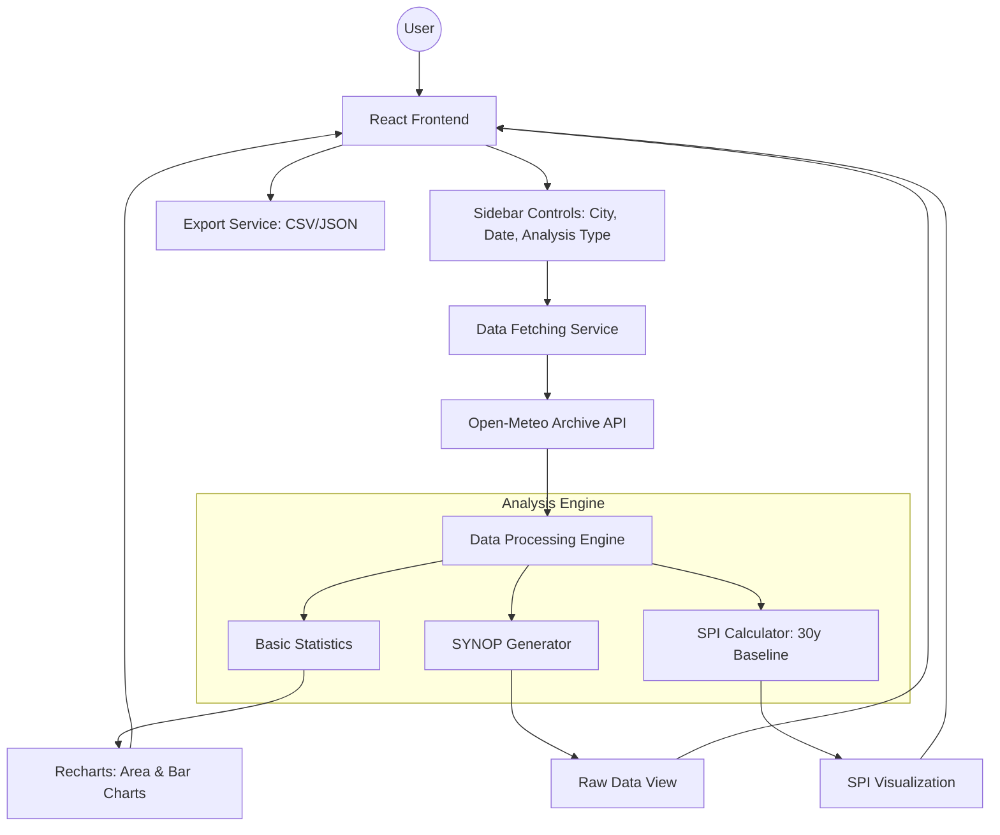

# Algeria Weather Analytics & Drought Monitoring (SPI)

A professional-grade weather analytics platform tailored for Algeria, providing real-time monitoring, historical data analysis, and advanced drought assessment using the Standardized Precipitation Index (SPI).

## 🌟 Key Features

- **Comprehensive Station Network**: Support for over 100 Algerian weather stations with official WMO codes (e.g., Alger Port 60369, Tamanrasset 60680).
- **Real-Time & Historical Data**: Hourly weather data including temperature, precipitation, humidity, wind speed, and pressure via Open-Meteo API.
- **SYNOP Simulation**: Generates simulated AAXX SYNOP messages for professional meteorological reporting.
- **Advanced Drought Analysis (SPI)**: 
  - Calculates the **Standardized Precipitation Index (SPI)**.
  - Uses a **30-year historical baseline** to determine drought severity.
  - Visualizes wet/dry cycles over the last 24 months.
- **Data Export**: Export station lists and weather data in **CSV** and **JSON** formats.
- **Responsive UI**: Polished dashboard built with React, Tailwind CSS, and Framer Motion.

## 📊 Solution Architecture


> Fichier source éditable: [architecture.excalidraw](./architecture.excalidraw). Voir la version détaillée dans [docs/architecture.md](./docs/architecture.md).



## 🚀 Getting Started

### Prerequisites
- Node.js 18+
- npm

### Installation
1. Clone the repository
2. Install dependencies:
   ```bash
   npm install
   ```
3. Start the development server:
   ```bash
   npm run dev
   ```

## 🛠️ Tech Stack
- **Frontend**: React 19, TypeScript, Vite
- **Styling**: Tailwind CSS
- **Charts**: Recharts
- **Animations**: Framer Motion
- **Icons**: Lucide React
- **Data Source**: Open-Meteo Historical API

## 📖 Methodology: SPI Analysis
The Standardized Precipitation Index (SPI) is the WMO-recommended index for drought monitoring. 
1. **Baseline**: We fetch 30 years of daily precipitation data for the selected coordinates.
2. **Standardization**: We calculate the mean and standard deviation for each calendar month.
3. **Index**: The SPI value represents the number of standard deviations the current precipitation deviates from the long-term mean.
   - **SPI ≤ -2.0**: Extremely Dry
   - **SPI ≥ 2.0**: Extremely Wet

## 📄 License
This project is licensed under the Apache-2.0 License.
