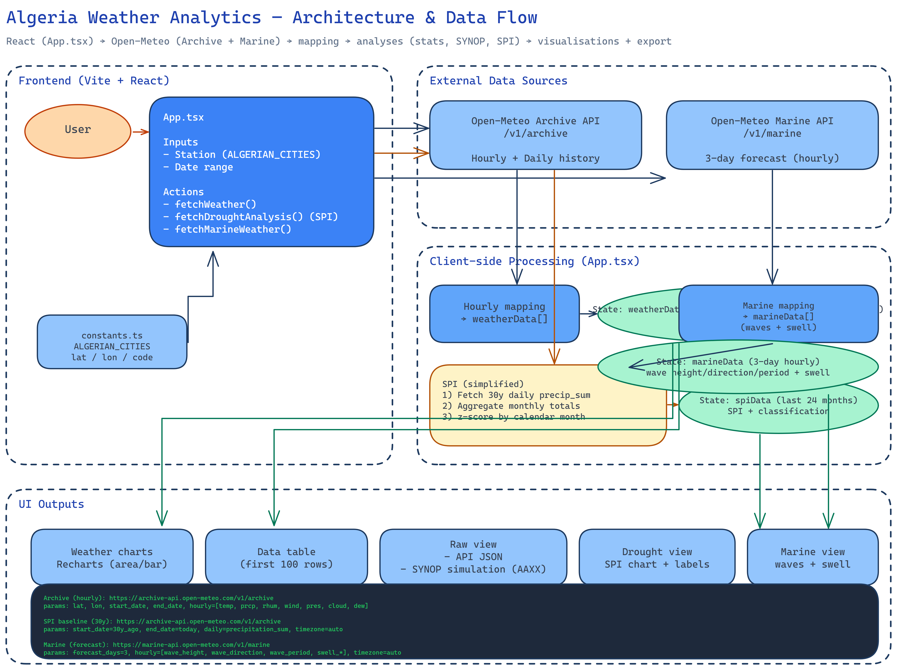

# Architecture — Algeria Weather Analytics

- Source éditable: [`architecture.excalidraw`](../architecture.excalidraw) — importez le fichier sur https://excalidraw.com pour le modifier.

## Vue d’ensemble
- Frontend React (Vite + TS) gère entrées utilisateur, fetch API et rendu.
- Données météo historiques via Open‑Meteo Archive API, données marine via Marine API.
- Traitements côté client: mapping horaire, calcul SPI simplifié (30 ans), jeu de données marine.
- Vues: graphiques, tableau, raw/SYNOP, sécheresse (SPI), marine.

## Appels principaux
- Archive (hourly): `https://archive-api.open-meteo.com/v1/archive`
  - params: latitude, longitude, start_date, end_date
  - hourly: temperature_2m, precipitation, relative_humidity_2m, wind_speed_10m, surface_pressure, cloud_cover, dew_point_2m
- SPI baseline (30y): même endpoint, params: start_date=30y_ago, end_date=today, daily=precipitation_sum, timezone=auto
- Marine (forecast): `https://marine-api.open-meteo.com/v1/marine`
  - params: latitude, longitude, forecast_days=3, hourly=[wave_*, swell_*], timezone=auto

## Flux de données
1. Sélection station + période → `fetchWeather()` → mapping vers `weatherData[]`.
2. Analyse SPI → `fetchDroughtAnalysis()`:
   - agrégation mensuelle des précipitations sur 30 ans
   - normalisation par mois calendaire → `spiData` + classe (dry/wet).
3. Météo marine → `fetchMarineWeather()` → `marineData[]` (vagues + houle).
4. Restitution: Recharts (area/bar), table, vue brute/SYNOP, graph SPI, vue marine.

## Notes d’édition
- Le PNG est régénéré à partir du `.excalidraw` pour conserver une source unique.
- Évitez de modifier l’image directement: mettez à jour le `.excalidraw` puis re‑rendez.

